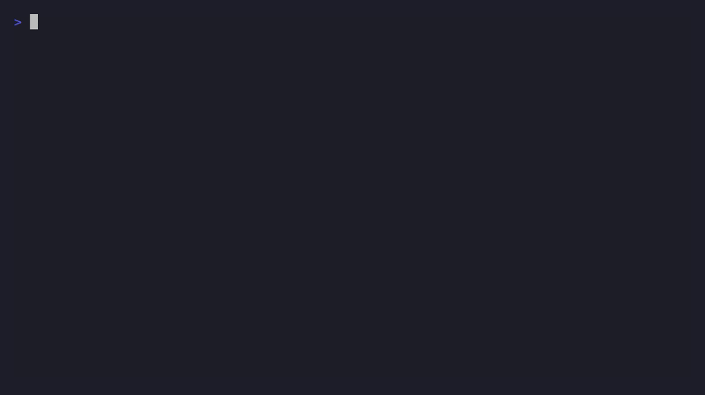

<h1 align="center">
  devsync
</h1>

> A single Go CLI that keeps a local dev environment in sync with the
> tools and Claude Code skills declared in this repo.

<p align="center">
  
</p>

`devsync` diffs two sources of truth declared in this repo against your
local machine:

- **Tools** — versions declared in the repo's `mise.toml`, applied via
  `mise use`/`mise uninstall` (backend: `providers/mise`).
- **Skills** — Claude Code skill directories declared under the repo's
  top-level `skills/` folder, installed into `~/.claude/skills`
  (backend: `providers/skills`).

Both resource kinds are diffed and presented in one combined
select/confirm screen, distinguished only by a `[tool]`/`[skill]`
label prefix — there is no separate command per resource kind.

## Why devsync?

Tool versions and Claude Code skills tend to drift silently: a `mise.toml`
gets a new pin, a skill gets updated in the repo, and nothing tells your
machine about it until something breaks in a subtly different way locally
than in CI. `devsync` closes that loop with one command: it diffs what's
declared in this repo against what's actually installed on your machine,
shows you exactly what would change, and applies only what you confirm.

Adding a new synced resource kind means implementing the `core.Provider`
interface in a new `providers/<name>` package — `core/` never needs to
change.

## Install

Download and run the installer from GitHub with `curl`:

```bash
curl -fsSL https://raw.githubusercontent.com/bruaguspons/devsync/main/install.sh | bash
```

This downloads the latest GitHub Release for your platform (`linux/amd64`
or `linux/arm64`), installs the `devsync` binary to `~/.local/bin`, and
installs the bundled `mise.toml.snapshot`/`skills.snapshot` to
`~/.local/share/devsync`. Re-running the same command updates an
existing install to the latest release.

## Usage

```bash
devsync            # diff, select, confirm, apply
devsync -version   # print version and exit
devsync -yes       # apply every pending change without an interactive prompt (non-TTY, e.g. Docker build)
```

A typical run:

```
$ devsync
[tool]  go            desired 1.23.4   local 1.22.0   -> update
[skill] smart-commit   desired a1b2c3d  local (none)   -> install
? Select changes to apply  [use arrows/space, enter to confirm]
```

If local state already matches desired state for every provider, no
selection screen is shown and the command reports "Everything is
already in sync."

## Architecture

```
main.go           # composition root: wires providers, calls core.Run
core/             # provider-agnostic domain layer (no mise/skills imports)
  resource.go       # Resource, DiffItem, ApplyResult
  provider.go        # Provider interface (Kind/LocalState/DesiredState/Apply)
  diff.go             # generic Diff() algorithm
  ui.go                # huh select/confirm UI
  lock.go               # lock file schema + reconciliation
  run.go                 # orchestration
providers/
  mise/             # mise-managed tools backend
  skills/           # repo skills/ folder backend
```

`core/` never imports a concrete provider package; the dependency
direction is `main.go -> providers/* -> core`, never the reverse.

## Skills sync

- **Desired state**: the repo's top-level `skills/<name>/` directories,
  bundled into the release archive as `skills.snapshot/` (mirroring how
  `mise.toml` ships as `mise.toml.snapshot`) and installed to
  `~/.local/share/devsync/skills.snapshot` by `install.sh`.
- **Local state**: whatever exists under `~/.claude/skills/<name>/`,
  regardless of how it got there.
- **Diffing**: SHA-256 over the full directory tree (relative path +
  content, sorted, NUL-separated), not semver — a rename-only change is
  detected as a hash change.
- **Applying**: install/update overwrites `~/.claude/skills/<name>` with
  the repo's copy (remove-then-copy); remove deletes only that named
  subdirectory. Both operations only ever touch the single named skill
  directory, never its parent.

`devsync` intentionally does **not** read or write
`.atl/skill-registry.md` or the gitignored `skills-lock.json` used by
gentle-ai's own skill-registry mechanism — a skill installed by that
mechanism will show up as an "update" or "removed" candidate the next
time `devsync` runs, and applying it will overwrite/delete those files
without reconciling ownership. This is expected, surfaced (never
silent — the user selects and confirms before anything is deleted),
accepted-risk behavior, not a bug.

## Lock file

`devsync` writes `~/.local/share/devsync/devsync-lock.json` after every
successful apply, recording each resource's kind/name/version. It is a
**cache, not a trust source**: `LocalState()` is always queried fresh
on every run (`mise ls --json` for tools, an on-disk hash walk for
skills) and always wins the diff. The lock is only ever used to skip
recomputing a skill's SHA-256 hash when that skill directory's on-disk
mtime hasn't changed since the last successful apply — a pure
performance optimization that can, at worst, cause one extra or
avoided hash recompute, never a wrong reported state.

This lock file is entirely separate from (different path, different
schema, never read/written together with) the gitignored
`skills-lock.json` used by gentle-ai's skill-registry mechanism.

## Release

Every push to `main` runs `.github/workflows/auto-tag.yml`, which inspects
the new commits' conventional-commit prefixes and pushes a new `v*` tag
(patch bump by default; `feat:` bumps minor, `BREAKING CHANGE`/`!` bumps
major). That tag push triggers `.github/workflows/release.yml`, which runs
`goreleaser release --clean` per `.goreleaser.yaml`: builds `linux/amd64`
and `linux/arm64`, bundles `mise.toml.snapshot` and `skills.snapshot` into
the archive, and publishes to GitHub Releases. `install.sh` downloads and
installs from those release archives — so merging to `main` with a
conventional commit message is all that's needed to ship a new release.

## Contributing

```bash
go build .              # build the devsync binary
go test ./...           # run all Go tests
go test ./core/...      # test a single package
bash install_test.sh    # test the installer script
gofmt -l .              # check formatting (no golangci-lint config in this repo)
go vet ./...
```

To add a new synced resource kind, implement the `core.Provider`
interface (`Kind`/`LocalState`/`DesiredState`/`Apply`) in a new
`providers/<name>` package and wire it into `main.go` — `core/` should
never need to change for this.

Commit messages follow [Conventional Commits](https://www.conventionalcommits.org/)
— see [Release](#release) for why that matters beyond style.
